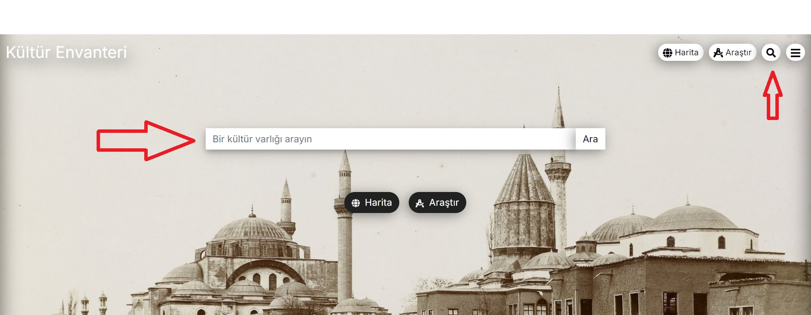
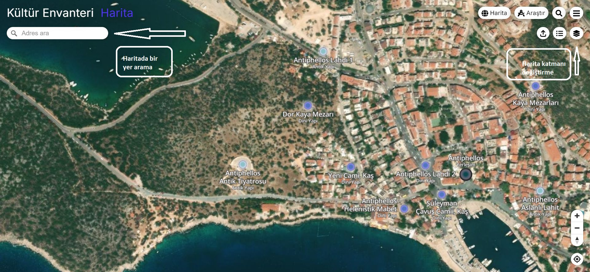
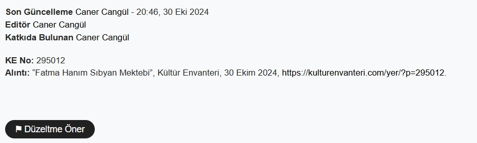
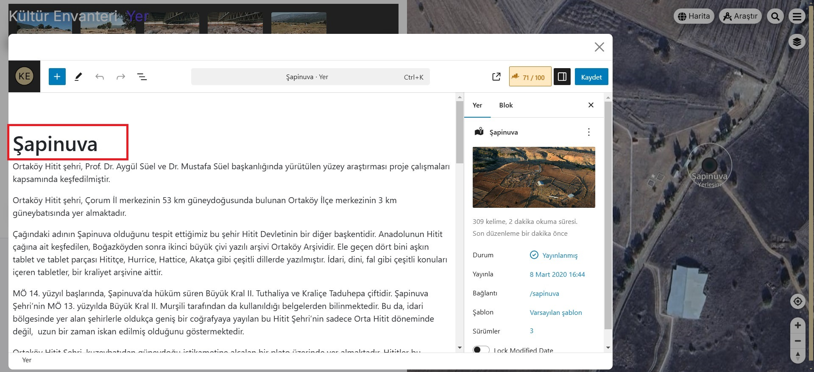
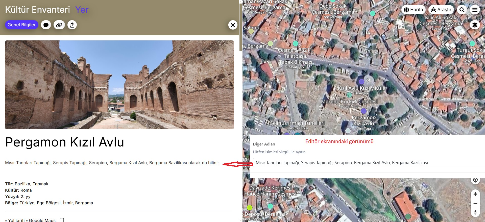
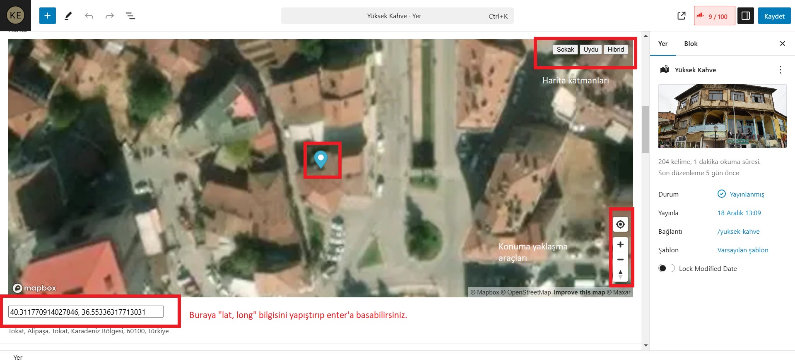
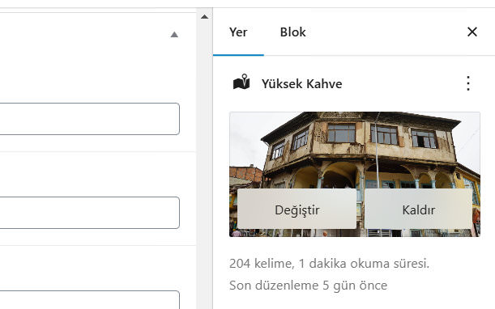

# Kullanım Rehberi

Bu rehberde, Kültür Envanteri’nin genel kullanımı ile ilgili teknik bazı bilgiler ve ipuçları yer alıyor. Sol bölümde yer alan başlıkları kullanarak ilgili bölüme hızlıca ulaşabilirsiniz. Kültür elçileri "Editör Rehberi" kısmını daha dikkatli incelemelidir.

## Kültür Varlığı Arama

Ana sayfa, taksonomi sayfaları veya tekil yer sayfalarında göreceğiniz arama butonu ile bir kültür varlığı adı, tür, yerleşim ya da herhangi bir terim girerek arama yapabilirsiniz. Arama sonuçlarını liste olarak görebileceğiniz gibi harita üzerine de yerleştirebilirsiniz. Bunun için arama sonuçlarının gösterildiği sayfanın sağ üstüne bulunan "Harita - Liste" butonlarına tıklayabilirsiniz. 

Eğer birden fazla terim girmek istiyorsanız boşluk bırakın. Birden fazla terimin aynı anda arandığı durumlarda, yalnızca her iki terimin de kesiştiği sonuçlar görüntülenecektir. 

Eğer arama sonucu araştırmanız için beklediğiniz sonuçlardan fazlasını gösteriyorsa, daha hedefe dönük sonuçlar almak için lütfen "Araştır" bölümünü kullanınız.

> Örn: [Kastamonu](https://kulturenvanteri.com/harita/?_ara=Kastamonu), [Kale](https://kulturenvanteri.com/harita/?_ara=Kale), [Çeşme](https://kulturenvanteri.com/harita/?_ara=Çeşme), [Selçuklu](https://kulturenvanteri.com/harita/?_ara=Selçuklu), [Hitit](https://kulturenvanteri.com/harita/?_ara=Hitit), [Safranbolu](https://kulturenvanteri.com/harita/?_ara=Safranbolu), [Aspendos](https://kulturenvanteri.com/harita/?_ara=Aspendos) …

## Filtreleme

Kültür Envanteri'nde arama sonuçlarına daraltmak için filtreleme yöntemini kullanabilirsiniz. Filtreleme kutusunda yer alan Grup, Tür, Kültür, Yüzyıl veya Durum seçimleri yaparak aramalarınızı daraltabilir ve sonuçları eş zamanlı harita üzerinde görüntüleyebilirsiniz. Hiç arama yapmadan belirli sonuçları görmek istiyorsanız "Araştır" bölümünü kullanabilirsiniz.

## Harita Kullanımı

Harita Kültür Envanteri'nin en ayırıcı özelliğidir. 

Ulaştığınız sonuçları harita üzerine görebileceğiniz gibi, her kültür varlığı sayfasında da harita bulunmaktadır. Mobil telefonlardan erişimde haritayı görmek için telefonu yan çevirmelisiniz. 

Tüm kültür varlıklarının gösterildiği harita ise periyodik olarak güncellenmek olup sitenin daima en üstünde yer alan "Harita" linki ile kolayca erişelebilir durumdadır.

Üstteki resimde göreceğiniz üzere farklı harita katmanları arasından seçim yapabildiğiniz gibi, harita sağlayıcı verileri üzerinden arama yaparak istediğiniz bölgeye de hızlıca erişebilirsiniz.
 
## Eksik Veya Hatalı İçerik Bildirme

Bir "Kültür Varlığı" ile ilgili eksik veya hatalı bir bilgi gördüğünüzde, ilgili sayfanın sağ altında yer alan **"Düzeltme Öner"** bağlantısı ile bize ulaştırabilirsiniz.

Eğer haritada var olmayan bir kültür varlığını bize bildirmek isterseniz, [iletisim@kulturenvanteri.com](mailto:iletisim@kulturenvanteri.com?subject=İçeriğe%20Katkı) adresine konum ve diğer bilgileri içeren e-posta gönderebilirsiniz. Daha detaylı bilgi için "Katılım" başlığını okuyun.

## Yol Tarifi Alma

Kültür varlıklarının konumlarını mümkün olduğunca titizlikle belirlemekteyiz. Böylelikle sizlere veritabanımızda yer alan kültür varlıklarına adres tarifi alabilmeniz için [Google Maps](https://www.google.com/maps) servisinden faydalanarak kolaylık sağlıyoruz. Bir kültür varlığı sayfasında veya harita bilgi kutusunda yer alan Yol tarifi al⤷ bağlantısına tıklayarak bulunduğunuz noktadan, ilgili noktaya kadar bir tarif alabilirsiniz. Adres tarifi için cihazınızın konum bilgileri erişimine açık olması gerekmektedir.

## Konumunuzu Gösterme

Haritanın sağ altında yer alan konumumu göster işaretine tıklayarak, var olan konumunuzu harita üzerinde görebilirisiniz. Cihazınızın pusula özelliği açık ise, konumunuz ile birlikte bakış yönünüzü de harita üzerinde göreceksiniz.

# Katılım Rehberi

Kültür Envanteri, katılımcılık ve işbirliğine dayalı bir anlayışla geliştirilmektedir. Eğer projemize dahil olmak isterseniz, bu başlığı okuyarak neler yapabileceğiniz hakkında fikir sahibi olun.

Veri tabanımızda yer almayan bir kültür varlığı hakkında bilgi sahibi iseniz, eklenmiş bir kültür varlığında eksik ya da hata görmüşseniz bize bildirebilirsiniz. Katkılarınızdan memnuniyet duyacağız. 

## İletişim Kanalları

E-posta, Telegram veya Twitter üzerinden de katkıda bulunabilirsiniz. Kültür varlıkları ile ilgili elinizdeki belgeleri konum bilgisi ile birlikte bize ulaştırın.

Hem kültür elçileri olarak sürekli haberleşiyoruz, hem de yaptığımız çalışmalarla alakalı sık bilgilendirme yapmaya gayret ediyoruz. Telegram kanalımızdan veya Twitter hesabımızdan bize ulaşabilir, sohbetlerimize katılabilir ve güncellemelerden haberdar olabilirsiniz.

### Twitter - X

X kullanıcısı iseniz #kültürenvanteri şeklinde etiketleyerek tweetlediğiniz gönderileri değerlendirerek envantere dahil ediyoruz.

Kültür Envanteri'nin [X hesabını](https://x.com/envanteratlasi/) da takip edebilirsiniz.

### Telegram

Telegram kanalımıza üye olarak sohbetlerimize dahil olabilir ve katkı sunabilirsiniz.  [Kültür Envanteri Telegram Grubu](https://t.me/kulturenvanteri)

### E-posta

E-posta yoluyla bize ulaşabilir ve  içeriğimize katkıda bulunabilirsiniz. [iletisim@kulturenvanteri.com](mailto:iletisim@kulturenvanteri.com?subject=İçeriğe%20Katkı)

## Vikipedi Sayfası Düzenleme

Sitemizde yer alan kültür varlıkları ile ilgili eğer bir Vikipedi makalesi bulunuyor ise, eşleştirme yaparak içeriği sayfalarımızda yayınlıyoruz. Vikipedi makalelerini düzenleyerek veya daha önce yayınlanmamış bir konuda Vikipedi’ye katkıda bulunarak da katılım sağlayabilirsiniz. Kültür varlığı sayfasında yayınlanan Vikipedi makalelerini hızlıca düzenlemek için metnin hemen altındaki “Düzenle” bağlantısı ile, sayfadan ayrılmadan içeriği düzenleyebilirsiniz. 

Katkılarınız, Vikipedi devriyeleri tarafından sayfa düzeni ve kaynaklar kontrol edilerek, doğrulukların onaylanmasının ardından yayınlanır.

## Editör Ekibimize Katılın

Ben daha fazlasını yapmak istiyorum, belirli bir tür ya da şehrin kültür varlıkları üzerine çalışmak istiyorum diyorsanız o halde bize katılın. Detaylı bilgi için [Kültür Elçileri](https://kulturenvanteri.com/tr/katkida-bulunun/) sayfasına bakın.

# Editör Rehberi

Kültür Envanteri’nde yer alan tüm varlıkların içeriğini zenginleştirmek ve kapsamlı bir kaynak sunmayı amaçlıyoruz. Bunun için belirlediğimiz standartları ve editörlerin dikkate alması gereken noktaları bu başlık altında okuyabilirsiniz.

## Yer Ekleme

Haritaya bir Kültür varlığı eklerken bu varlık hakkında bazı temel bilgilere sahip olmamız gerekiyor. Harita temelli bir arşiv olduğumuz için keskin bir konum bilgisine sahip olmak ve İsimlendirmek başlıca gerekliliklerdir. Bu iki temel bilgiye sahipsek haritamıza yer eklemeye başlayabiliriz.

Haritaya neyin eklenip eklenmeyeceğine karar vermek için temel bazı kriterlerimiz var. Öncelikle "Kültür Varlığı" tanımına uygun olması gerekiyor. Kararsız kaldığınız durumlarda Telegram Editör Grubu'nda konuyu tartışmaya açmaktan lütfen çekinmeyin.

## Kültür Varlığının Adı

Kültür varlığının adını belirlerken, resmi kaynaklarda nasıl adlandırıldığını dikkate alarak, en bilinen ve sık kullanılan halini belirlemeye çalışıyoruz. Bunun için Kültür Bakanlığı web sitesi, Vikipedi gibi kaynaklardan karşılaştırma yapabilirsiniz.

Başlıkta, varlığın sadece öne çıkan isminin belirtilmesi gerekir. Dolayısıyla ana başlıkta tek bir ismin belirtilmesi, **parantez içinde veya başka bir şekilde aşağıda belirtilen hususlar dışında başka bir bilgi girilmemesi gerekir**. Yer bilgisi düzenleme panelinde göreceğiniz metin alanına diğer önemli bilgileri girebilirsiniz. Başka bilinen isimler için “Diğer Adları” başlığını inceleyin.

Eğer kültür varlığının adı veritabanında daha önce sıkça kullanılmış ise, birbirinden ayırmak için isme bazı eklemeler yapıyoruz. Bunun için bazı standartlar belirledik:

- Aynı isimli veya ismi belli olmayan yapı örneğine rastlanması durumunda adlandırma:

    - **İstanbul için:** 

        İsim, Mahalle Adı*
           
        >Örnek 1: Cezayirli Hasan Paşa Çeşmesi, Camii Kebir
        
        >Örnek 2: Çeşme, Topkapı

        - İstanbul’daki aynı mahalle aynı isimli yapılar için:

            İsim, Mahalle Adı* - Sokak İsmi
            
            >Örnek 1: Cezayirli Hasan Paşa Çeşmesi, Camii Kebir - Paşa Çeşmesi Sokak
            
            >Örnek 2: Çeşme, Topkapı - Topkapı Caddesi

        - İstanbul haricindeki şehirlerde bulunan yapılar için: 

            İsim, İlçe Adı

            >Örnek 1: Mustafa Paşa Çeşmesi, Nilüfer 
            
            >Örnek 2: Çeşme, Bolvadin

    - **İstanbul haricindeki şehirlerde aynı ilçede aynı isimli yapılar için:**

        İsim, İlçe Adı - Mahalle Adı*
       
        >Örnek 1: Mustafa Paşa Çeşmesi, Nilüfer - Merkez 
        
        >Örnek 2: Çeşme, Nilüfer - Merkez

- Özgün yerinden taşınan yapı örneğine rastlanması durumunda adlandırma: 

Bu durumda iki başlık açılması gerekeceği için özgün yere işaretli başlıkta parantez içinde “Eski Yeri” İfadesi eklenmelidir. Eğer isim benzerliği gibi bir durum varsa yukarıda belirttiğimiz kapsamda verilen bilgilere göre konum bilgisi ilave edilecektir.

> Örnek: Ahmet Ağa Çeşmesi (Eski Yeri), Topkapı

- İsmi belirsiz bir kültür varlığı eklenmesi durumunda adlandırma:

Tür adı, Semt/Mahalle Adı*

> Örnek: Çeşme, Bolvadin

***Mahallenin adı yazılırken ayrıca “Mahallesi” ifadesine gerek yoktur.**

## Diğer Adları

Farklı kaynaklarda kullanılan veya halk arasında bilinen diğer adları bu bölüme **aralarında virgül ve bir boşluk bırakarak** yazın. Buraya girilen metinler, önyüzde ziyaretçiler tarafından görünmesinin yanı sıra, site içi arama sonuçlarını da etkilemesi bakımından önemlidir. Bu yüzden yazım kurallarına, boşluk ve virgüle dikkat etmenizi rica ediyoruz.

> Örnek: Ulu Cami, Alaeddin Camii, Çarşı Camii.

## Grup

Grup, veritabanımızın en üst seviye sınıflandırma başlığıdır. En genel hali ile, Birincil kullanım amacına göre bir grup belirliyoruz. Her grup parametresinin kendine ait bir renk kodu bulunuyor ve belirlediğimiz grup parametresi aynı zamanda haritanın lejantını da belirliyor. Burada elimizden geldiğince birincil olanı belirliyoruz. Birden fazla gruba ait olabilecek varlıklar için emin olmadığınız durumlarda lütfen Telegram'daki **Kültür Elçileri Grubu**nda tartışmaya açmaktan çekinmeyin. 

Grup, geniş bir tanımlama taksonomisi olduğundan, belirlemek diğer parametrelere göre daha zordur. Envanter içinde mümkün olduğunca en mantıklı olanı belirlemek adına tartışmalarımız sürüyor. 

Şimdiye kadar belirlediğimiz bazı özel noktalar var:

> **Hamam, Çeşme** gibi kültür varlıklarını, "Su Yapısı" değil **"Sosyal Yapı"** olarak grupluyoruz. Çünkü bu tür yapılar kullanım bakımından daha çok insanlarla ilişki halindedir. 

> **Su Kemeri, Baraj, Sarnıç** gibi kültür varlıklarını ise **"Su Yapısı"** olarak grupluyoruz. Çünkü bu yapılar su taşıma ve depolama altyapılarını oluşturuyor.

## Tür

Kültür varlığının niteliğine bağlı olarak türü hakkında sınıflandırma yapıyoruz. Şu anda var olan tür seçeneklerinden birini seçebilir veya yeni bir tür önerisinde bulunabilirsiniz. Bir kültür varlığı ile ilgili birden fazla tür seçebilirsiniz.

> Örnek: Ayasofya için: "Cami, Müze, Kilise ve Manastır"

## İdari Bölge

Kültür varlığı hangi idari yönetim sınırlarında yer alıyor ise, Ülke / Bölge / İl / İlçe / Mahalle veya Köy ilişkisi kurarak 5 aşamalı şekilde sınıflandırıyoruz. Bir konum belirlerken en alt idari birimi eklemeniz yeterlidir. Konumla ilişkili üst bilgiler otomatik eklenecektir.

> Örnek: Konum olarak *“Gelemiş”* köyünü eklerseniz, *“Türkiye, Akdeniz Bölgesi, Antalya, Kaş”* üst bilgileri de otomatik eklenecektir. Eğer eklemek istediğiniz konum veritabanımızda bulunmuyor ise önce “Konum” taksonomi sayfasından alt-üst ilişkisine uygun olarak yeni bir konum oluşturmanız gerekmektedir.

Özellikle büyük şehirlerde 5. aşamayı eklemek önem kazanmaktadır. Mahalle ismini bilmiyorsanız google haritalarda ilgili noktayı tıklayabilirsiniz.

> Not: İstanbul gibi şehirlerde semt adını değil mahalle adını girmekteyiz. Yani Edirnekapı, Eminönü, Galata, Karaköy gibi isimler yerine bağlı olduğu mahalli idare adını kullanıyoruz.

## Yüzyıl

Her kültür varlığını tarihlendirmeyi hedefliyoruz. Yapıldığı yüzyıla göre, gerekirse birden fazla yüzyıl seçerek tarihlendiriyoruz. Tarihlendirme için belirlediğimiz format şu şekilde: 

> Örnek: “18. yy”

Eğer milattan önce ise başına MÖ ekleyerek şu şekilde yazıyoruz: 

> Örnek “MÖ 8.yy”

Eğer tarihlendirme araştırdığınız kaynaklarda kesinleşmemiş veya soru işaretli ise “?” etiketini de ekleyebilirsiniz.

## Kültür

Bir kültür varlığını, yapıldığı dönemdeki ait olduğu kültüre göre sınıflandırıyoruz. Eğer bir kültür varlığı yıllar içinde farklı kültürler tarafından değişime uğratılmış ise, diğer kültürleri de dahil ediyoruz.

> Örnek: Ayasofya kültür varlığı için; Kültür: “Bizans, Osmanlı”

## Tema

Kültür varlıkları için tematik haritalar da oluşturuyoruz. Eğer yeni eklenen bir kültür varlığı mevcut temalardan birine ait ise bunu da tanımlıyoruz. Örnek: Kadın Baniler, Mimar Sinan Eserleri, Kiliseden Camiye Dönenler

Ayrıca sürekli olarak yeni temalar oluşturuyoruz. Tema önerilerinizi iletebilirsiniz.

## Coğrafi Konum

Bir kültür varlığının haritada yer alabilmesi için coğrafi konum bilgisine ihtiyacımız var. Yeni bir yer eklerken veya eklenmiş bir kültür varlığının hatalı konumunu düzeltmek isterken, editör sayfasında bulunan haritadan yaklaşarak işaretleme yapabileceğiniz gibi, üçüncü harita hizmeti sunan Google Maps gibi yerlerden "Lat, Long" şeklinde konumu kopyalayarak ilgili bölüme yapıştırıp enter tuşuna basmanız halinde de güncelleme yapabilirsiniz.

> Örnek: "36.9504356, 35.9239426"

## Galeri

Galeri bölümü, bir kültür varlığı ile ilgili her çeşit görsel belge ekleyebileceğiniz bir alandır. Bir fotoğraf, çizim, kroki, harita veya gravür ekleyebilirsiniz. Kendi fotoğraflarınızı, çizimlerinizi ekleyebilir veya telif haklarına ve veri kullanım politikalarına dikkat etmek koşulu ile çeşitli kaynaklardan görsel temin edebilirsiniz. 

Dikkat! İnternetten arama yoluyla fotoğraf temin edip yüklemeyiniz. Sadece resmi arşiv sitelerinden telifi kullanıma uygun fotoğrafları, fotoğrafa ait doğru bilgilerle ve ilgili fotoğrafın kaynak adresini belirterek ekleyebilirsiniz. Vikipedi'de bulunan fotoğrafları, Vikipedi telif kuralları gereği kaynağını ve kaynak adresini belirtmek suretiyle eklemenin bir sakıncası yoktur.

Bir telif hakkı ihlali olduğunu düşündüğünüz durumlarda lütfen bizimle [iletişime geçin](mailto:iletisim@kulturenvanteri.com?subject=Telif%20Hakkı%20İhlali).

### Görsel Dosya Standartları

Bir dosya eklerken dikkat etmeniz gereken bazı standartlar var. **Dosyanın geniş kenarı maksimum 1920px minimum 1024px olacak şekilde optimize edilmeli ve .jpg formatı tercih edilmelidir.** Fotoğraflar çok küçük ölçülerde veya düşük kalitede olmamalıdır.

Galeriye eklenecek görsel malzemenin içeriğe doğrudan katkı sağlamasının yanı sıra, belge niteliği ve estetik kaygı taşıması da beklenir.

Fotoğrafların en-boy oranları görsel düzeni açısından önemlidir. 3x4, 9x13, 10x15 gibi profesyonel kamera standartlarına uymaya gayret gösteriniz. Son dönem çeşitli cep telefonları 2x1 oranından daha fazla olacak şekilde standart dışı fotoğraf çekmektedir. Ayrıca bir fotoğrafı ekran görüntüsü alarak, Whtsapp'dan kendinize göndermek suretiyle boyut düzenlemesi yaparak eklemeyiniz. Fotoğraf boyutlandırma konusunda pekçok program bulunmakta olup, bu konuda Telegram grubundan da yardım alabilirsiniz.

### Görsel Dosya Bilgileri

Belge adı ve açıklaması, ilgili kültür varlığına uygun bir şekilde doldurulmalıdır. Ayrıca eklediğiniz belgenin “yaratılış tarihi”, “oluşturan kişi veya kurumun adı”, “kaynağın web adresi” bilgilerini tamamlamaya özen gösterin. “Alternatif metin, başlık ve altyazı” görsel ile ilgili detaylarda önemlidir. Başlık ile aynı metni de kopyalabilirsiniz. 

#### Başlık

Yer için belirlediğiniz başlık ile aynı şekilde doldurabilirsiniz. Bu bölüm, sitenin editör panelinde Medya Kütüphanesinde aramalarda editöryal kolaylık sağladığı için boş bırakmamanızı rica ediyoruz. Doldurulması tavsiye edilir. 

> Örnek: "Aspendos Tiyatrosu".

#### Altyazı

Sitenin ön yüzünde ziyaretçilerin fotoğraf hakkında bilgi sahibi olması içindir. En basitinden yer başlığı ile aynı şekilde doldurabilirsiniz. Veya biraz daha detay verebilirsiniz. Muhakkak doldurulmalıdır. 

> Örnek: "Kepenekçi Sinan Medresesi" yazabileceğiniz gibi en ideal şekilde “Kepenekçi Sinan Medresesi’nin kuzeydoğudan görünümü” de yazabilirsiniz.

#### Alternatif Metin

Arama motorlarının imajı tanımlayabilmesi için faydalıdır. En basitinden yer başlığı ile aynı şekilde doldurabilirsiniz. İsterseniz fotoğrafı daha detaylı tanımlayabilirsiniz. Doldurulması tavsiye edilir. 

> Örnek: "Kepenekçi Sinan Medresesi" yazabileceğiniz gibi “Kepenekçi Sinan Medresesi’nin kuzeydoğudan görünümü” de yazabilirsiniz.

#### Açıklama

Bu bölüm önyüzde ziyaretçiler tarafından görülmeyecektir. Genel amaçlı kullanabilirsiniz. 

#### Medya Etiketi

Doldurulması isteğe bağlı. Medya etiketleri editöryal amaçlı kullanım içindir. Medya kütüphanesinde imajları etiketleyerek gruplayabilir ve ihtiyaç anında kolayca filtreleyebilirsiniz.

> Örnek: "Çeşme", "Kitabe", "Müze"

#### Oluşturan

Doldurulması önemli! Fotoğraf ise, fotoğrafı çeken kişi; Çizim ise, çizimi bizzat yapan kişi. (Fotoğraf sahibi ile karıştırılmamalıdır. Sahibi ve oluşturan farklı olabilir.) Eğer ulaşabiliyorsaniz bu bilgiye ulaşın ve doldurun. Eğer ulaşamıyorsanız boş bırakın.

Eğer bu isim belli değil ise adı geçen kurum bilgisini de yazabilirsiniz. Eğer bu bilgilere ulaşamıyorsanız boş bırakın.

> Örnek: "Caner Cangül" "Salt Araştırma - Ülgen Ailesi Arşivi"

#### Yıl

İmajın oluşturulduğu yıl. Dört haneli ve yalnızca rakam olarak, ortam dosyasının oluşturulduğu tarihi yazın. Sitenin ön yüzünde ziyaretçiler tarafından görünür. Doldurulması önemlidir. 

> Örnek: "1997"

#### Kaynak

Eğer bir arşivden veya dijital koleksiyondan faydalanıyorsanız, ortam dosyasının kaynağının web adresini yazın. Mümkünse ortam dosyasının resmi olarak yayınlandığı orjinal kaynağını bulmaya çalışın. Fotoğraf size aitse boş bırakabilirsiniz. Doldurulması önemlidir.

> Örnek: https://archives.saltresearch.org/handle/123456789/109269

## Öne Çıkan Görsel

Her kültür varlığı için uygun bir ana fotoğraf belirliyoruz. Bunun için o kültür varlığını en iyi anlattığını düşündüğünüz fotoğrafı öne çıkarabilirsiniz. Eğer galeriye ilk kez siz fotoğraf ekliyorsanız, lütfen bu kısmı kontrol ediniz ve fotoğraf belirlenmemişse bunu belirleyiniz.

Eğer bir çeşme ise çeşmenin kitabesinden ziyade genel görünümü, bir cami ise iç görünümden ziyade camiyi bir bütün olarak gösteren bir dış çekim fotoğrafı seçilmelidir.

## Vikipedi Makalesi Eşleştirme

Bir kültür varlığı ile, ilgili Vikipedi makalesini eşleştirdiğimizde, Vikipedi içeriğini sayfalarımızda yayınlayabiliyoruz. Bunun için Vikipedi kutusuna eşleştireceğiniz makalenin adresindeki başlık kısmını eklemeniz yeterli.

> Örnek: Eklemek istediğiniz makalenin adresi, https://tr.wikipedia.org/wiki/Sait_Faik_Abasıyanık_Müzesi ise, sadece **Sait_Faik_Abasıyanık_Müzesi** kısmını buraya kopyalayıp yapıştırmanız yeterlidir. Eğer Türkçe bir Vikipedi sayfası yoksa boş bırakınız.

## İlgili Yerler

Bir kültür varlığı hemen yakınındaki bir başka kültür varlığı ile ilişkili ise bu ilişkiyi bu bölüm altında tanımlıyoruz. Özellikle külliye, antik kent gibi grup yapıları ile cami ve cami önündeki çeşmeler birbiriyle ilişkilidir. Burada dikkat edilmesi gereken husus, sadece yapısal ilişkiye bakılmasıdır. Bunun haricindeki ilişkilere göre lütfen bağ kurmayınız.

Eğer bir yer için *ilişkili yerler* tayin edilmişse, *ilişkili yerler*'in tümü tekil yer sayfasında yer alan haritada görünecektir.

> Örnek: Aspendos Antik Tiyatrosu ve Su Kemerleri Aspendos Antik Kenti ile ilişkilidir. 

### Örnek İlişkili Yerler

- Aspendos: https://kulturenvanteri.com/yer/aspendos/
- Perge: https://kulturenvanteri.com/yer/perge/
- Süleymaniye Camii: https://kulturenvanteri.com/yer/suleymaniye-camii-ve-kulliyesi/
